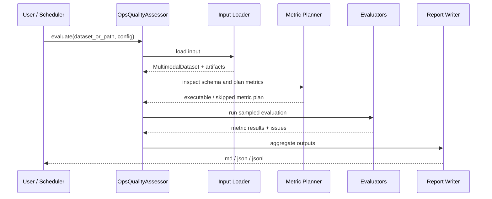

# 独立评估链路

## 统一入口

后续代码实现建议提供统一入口：

```python
report = OpsQualityAssessor.evaluate(
    dataset_or_path=dataset_or_path,
    config=OpsQualityAssessmentConfig(
        sample_size=1000,
        enabled_metrics=[
            "image_text_alignment",
            "video_image_alignment",
            "cross_modal_semantic_similarity",
            "concept_coverage",
            "text_semantic_preservation",
            "modality_gap",
            "qae_grounding_alignment",
            "coherence_score",
        ],
        output_dir="/path/to/eval_outputs",
    ),
)
```

## 输入类型

`dataset_or_path` 支持：

- 已构造好的 `MultimodalDataset`。
- Ray Dataset 可读路径。
- JSONL、Parquet、CSV 等最终数据产物路径。
- manifest 文件路径。

## 执行阶段



| 阶段 | 行为 |
| --- | --- |
| load input | 如果输入是 manifest，先解析 `dataset_uri`、`artifact_dirs`、`tracking_uri`。 |
| inspect schema | 采样读取字段列表，判断 `image_path`、`caption`、`video_path`、`samples`、`qae_triplets` 等字段是否存在。 |
| plan metrics | 根据 `enabled_metrics` 和字段可用性建立执行计划。 |
| sample records | 按 `sample_size` 抽样，可选按模态、视频长度、数据来源分层。 |
| run evaluators | 每个 evaluator 只消费所需字段，共享模型加载、embedding cache 和 batch 推理。 |
| aggregate report | 汇总均值、分位数、低分样本、跳过原因和建议。 |

## 指标状态

| 状态 | 含义 |
| --- | --- |
| `passed` | 指标完成且达到阈值。 |
| `warning` | 指标完成但存在低分样本或边界风险。 |
| `failed` | 指标完成且未达到阈值。 |
| `not_applicable` | 当前数据没有该指标所需模态或字段。 |
| `failed_precondition` | 指标被要求执行，但关键字段或产物缺失。 |
