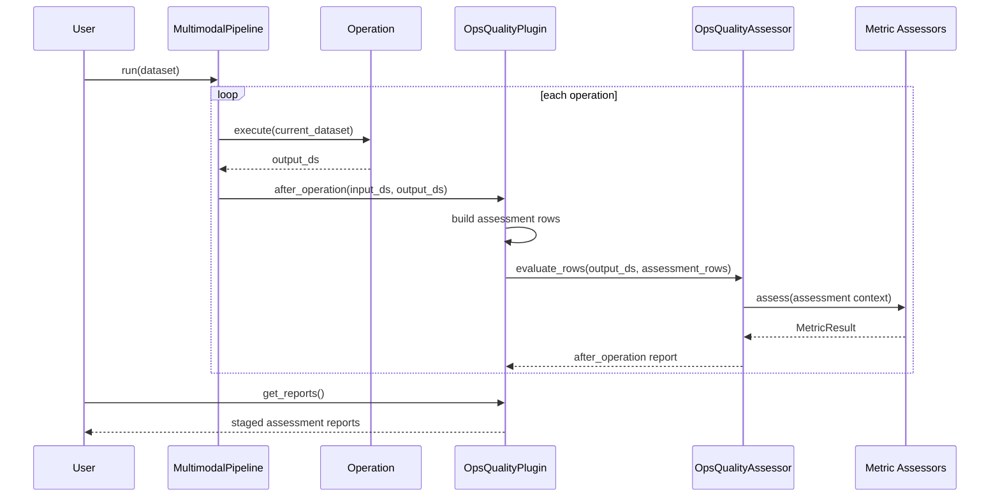

# 插入式评估链路

## 统一入口

评估体系作为 AscendDataForge `PipelinePlugin` 接入主 pipeline。插件不修改数据流，只在 pipeline 生命周期中读取当前 `MultimodalDataset` 快照并记录评估结果。

```python
from multimodal_data_processor.core.pipeline import MultimodalPipeline
from multimodal_data_processor.core.pipeline_plugin import OpsQualityPlugin
from multimodal_data_processor.quality.ops_quality_assessor import OpsQualityAssessmentConfig

ops_quality_plugin = OpsQualityPlugin(
    quality_config=OpsQualityAssessmentConfig(
        sample_size=1000,
        enabled_metrics=[
            "text_noise_contamination",
            "text_normalization_validity",
            "image_text_alignment",
            "video_image_alignment",
            "chair_object_hallucination",
            "text_semantic_preservation",
            "visual_transform_consistency",
            "visual_robustness",
            "qae_grounding_alignment",
            "coherence_score",
        ],
    ),
    assess_after_operations=True,
)

pipeline = MultimodalPipeline(plugins=[ops_quality_plugin])
result_dataset = pipeline.run(dataset)
reports = ops_quality_plugin.get_reports()
```

## 评估时机

- `initial_dataset assessment`：可拓展能力，可在第一个算子前评估原始多模态数据。
- `after_operation`：在每个算子执行后评估当前产物，例如 QAE 生成后检查 evidence grounding。
- 插件只保存报告，不把 `before_text` / `after_text` 等审计字段写回后续 pipeline。

## 执行阶段



| 阶段 | 行为 |
| --- | --- |
| plugin init | 构造 `OpsQualityAssessor` 和评估配置。 |
| after operation | 对每个算子后的 `output_ds` 运行适用 metric。 |
| build assessment rows | 以 `output_ds` 样本行为基础临时添加 `before_text=input_ds.text` 和 `after_text=output_ds.text`，不写回 pipeline，也不创建临时 Ray Dataset。 |
| sample records | 每次评估都按 `sample_size` 从当前快照采样。 |
| run metric assessors | 每个 metric 优先消费当前快照已有字段；缺 embedding 时尝试用配置的模型后端补算，仍无法计算时跳过相关 score 或返回 `failed_precondition`。 |
| collect reports | 插件在内存中记录 `stage`、`operation_name`、`op_index`、`duration_sec` 和评估结果。 |

## 指标状态

| 状态 | 含义 |
| --- | --- |
| `passed` | 指标完成且达到阈值。 |
| `warning` | 指标完成但存在低分样本、部分样本缺模型分数/embedding 或部分样本风险。 |
| `failed` | 指标执行异常或整体失败。 |
| `not_applicable` | 当前数据没有该指标所需模态或字段。 |
| `failed_precondition` | 指标被要求执行，但关键字段或产物缺失。 |
