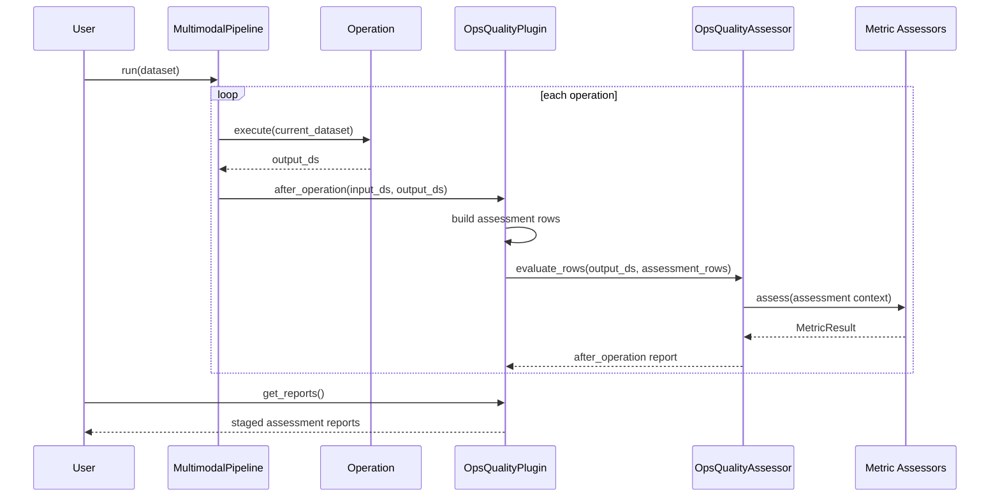

# 实现路线与评估链路

`OpsQualityAssessor` 当前作为 `OpsQualityPlugin` 的内部评估器使用。本页记录插入式评估链路、模块职责、执行路线和当前实现边界。

## 模块位置

```text
multimodal_data_processor/
  core/
    pipeline_plugin.py          # OpsQualityPlugin
  quality/
    ops_quality_assessor/
      __init__.py
      assessor.py
      base.py
      config.py
      context.py
      results.py
      metrics/
        __init__.py
        *.py
```

| 文件 | 职责 |
| --- | --- |
| `core/pipeline_plugin.py` | `OpsQualityPlugin`，在 `before_operation` / `after_operation` 中触发评估并记录报告。 |
| `assessor.py` | `OpsQualityAssessor.evaluate(dataset)`，串联 context 构建、metric 实例化和结果聚合。 |
| `config.py` | `OpsQualityAssessmentConfig`，定义 `sample_size`、`enabled_metrics`、`executed_operations` 和 `metric_configs`。 |
| `context.py` | 从当前 `MultimodalDataset` 快照抽取采样行、schema 字段和逐字段数据视图。 |
| `base.py` | `BaseMetricAssessor`、`ScoreSpec`、统一异常包装逻辑，以及 metric 配置解析。 |
| `results.py` | `MetricResult` 和 `OpsQualityAssessmentResult` 两个内存结果模型。 |
| `metrics/` | 各指标的独立实现。 |

`OpsQualityAssessor` 直接持有默认 metric assessor 类型列表，也允许调用方传入自定义 assessor 实例或类型。

## 统一入口

评估体系通过 AscendDataForge `PipelinePlugin` 接入主 pipeline。插件不修改数据流，只在 pipeline 生命周期中读取当前 `MultimodalDataset` 快照并记录评估结果。

```python
from multimodal_data_processor.core.pipeline import MultimodalPipeline
from multimodal_data_processor.core.pipeline_plugin import OpsQualityPlugin
from multimodal_data_processor.quality.ops_quality_assessor import OpsQualityAssessmentConfig

ops_quality_plugin = OpsQualityPlugin(
    quality_config=OpsQualityAssessmentConfig(
        sample_size=1000,
        enabled_metrics=[
            "text_noise_contamination",
            "text_normalization_validity",
            "image_text_alignment",
            "video_image_alignment",
            "chair_object_hallucination",
            "text_semantic_preservation",
            "visual_transform_consistency",
            "visual_robustness",
            "qae_grounding_alignment",
            "coherence_score",
        ],
    ),
    assess_after_operations=True,
)

pipeline = MultimodalPipeline(plugins=[ops_quality_plugin])
result_dataset = pipeline.run(dataset)
reports = ops_quality_plugin.get_reports()
```

## 评估时机

- `initial_dataset assessment`：可拓展能力，可在第一个算子前评估原始多模态数据是否语义对齐。
- `after_operation`：在每个算子执行后评估当前产物，例如 QAE 生成后检查 evidence grounding。
- 插件只保存报告。

## 执行路线



| 步骤 | 行为 |
| --- | --- |
| 1 | `OpsQualityPlugin.on_pipeline_init()` 构造 `OpsQualityAssessor`。 |
| 2 | 每次 `after_operation()` 接收当前算子的 `input_ds` 和 `output_ds`。 |
| 3 | 插件以 `output_ds` 样本行为基础构造临时评估 rows，并添加 `before_text=input_ds.text`、`after_text=output_ds.text`。 |
| 4 | `OpsQualityAssessor.evaluate_rows(output_ds, assessment_rows)` 创建 `EvaluationContextBuilder(self.config)` 并调用 `build_from_rows(...)`。 |
| 5 | `build()` 执行 `dataset.dataset.limit(sample_size).take_all()`，把采样行拉回内存。 |
| 6 | `build()` 读取 schema 并构造 `data[field_name] -> list[Any]` 的列视图。 |
| 7 | `evaluate()` 遍历 `config.enabled_metrics`，从内部 assessor 映射中取出对应 metric。 |
| 8 | 每个 metric 统一走 `BaseMetricAssessor.assess(context)`，把缺字段和异常转换成结构化状态。 |
| 9 | 插件把 `stage`、`operation_name`、`op_index`、`duration_sec` 和 `OpsQualityAssessmentResult` 保存到内存报告列表。 |

## 阶段行为

| 阶段 | 行为 |
| --- | --- |
| plugin init | 构造 `OpsQualityAssessor` 和评估配置。 |
| after operation | 对每个算子后的 `output_ds` 运行适用 metric。 |
| build assessment rows | 以 `output_ds` 样本行为基础临时添加 `before_text=input_ds.text` 和 `after_text=output_ds.text`，不写回 pipeline，也不创建临时 Ray Dataset。 |
| sample records | 每次评估都按 `sample_size` 从当前快照采样。 |
| run metric assessors | 每个 metric 优先消费当前快照已有字段；缺 embedding 时尝试用配置的模型后端补算，仍无法计算时跳过相关 score 或返回 `failed_precondition`。 |
| collect reports | 插件在内存中记录 `stage`、`operation_name`、`op_index`、`duration_sec` 和评估结果。 |

## 指标状态

| 状态 | 含义 |
| --- | --- |
| `passed` | 指标完成且达到阈值。 |
| `warning` | 指标完成但存在低分样本、部分样本缺模型分数/embedding 或部分样本风险。 |
| `failed` | 指标执行异常或整体失败。 |
| `not_applicable` | 当前数据没有该指标所需模态或字段。 |
| `failed_precondition` | 指标被要求执行，但关键字段或产物缺失。 |

## 当前实现边界

| 能力点 | 当前状态 |
| --- | --- |
| 接入方式 | `OpsQualityPlugin` 插入 pipeline 生命周期。 |
| 数据流影响 | 插件不修改、不替换 `MultimodalDataset`。 |
| 输入支持 | `OpsQualityAssessor.evaluate(...)` 接受当前 `MultimodalDataset` 快照。 |
| 每步评估 | 插件可在每个 operation 后评估临时 `assessment_rows`。 |
| 采样方式 | 当前使用 `limit(sample_size)`，属于顺序截断。 |
| metric planning | 当前直接遍历 `enabled_metrics`，由各 metric 自行返回 `not_applicable` / `failed_precondition`。 |
| 模型后端 | 当前优先使用已有 score/embedding；缺 embedding 时尝试用配置的模型后端补算，仍无法计算时跳过对应 score 或返回 `failed_precondition`。 |
| 输出落盘 | 当前插件保存内存报告，后续可扩展 writer。 |

## 行为基线

- 算子后产物可用于 QAE、视频结构、视觉变换等产物指标。
- before/after 型指标使用插件临时构造的 `before_text` / `after_text` 字段，不写回后续数据流。
- 评估失败只产生 warning 日志，不阻断 pipeline。
