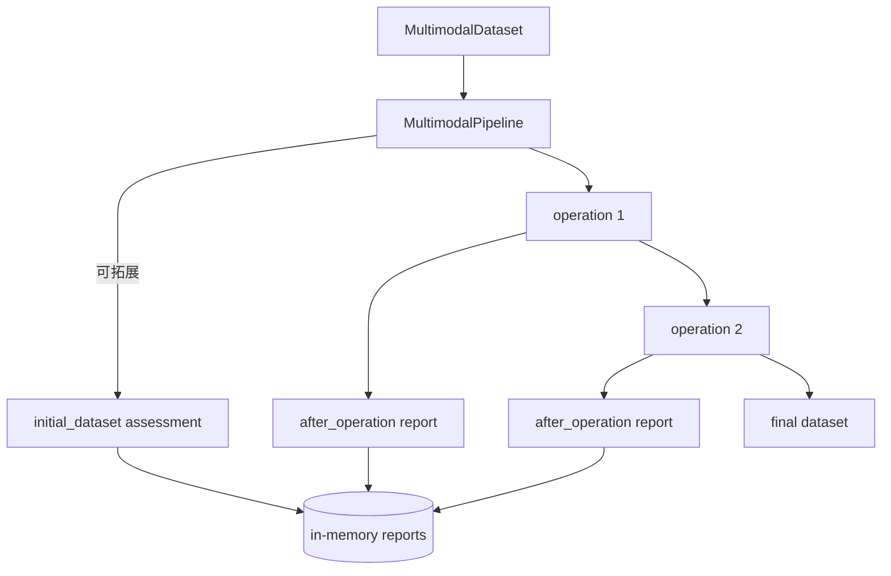

# Ops Quality Assessment

<section class="whitepaper-hero">
  
Multimodal Operator Quality Assessment

  <h1>面向多模态算子的插入式质量评估体系</h1>
  

    这份技术文档说明评估边界、Pipeline 插件执行链路、资源控制策略和核心指标定义。
  

</section>

## 核心结论

!!! abstract "评估链路作为 PipelinePlugin 插入主数据处理 pipeline"
    多模态语义质量评估通过 `OpsQualityPlugin` 接入 pipeline 生命周期。
    插件在每个算子执行后评估当前产物，只记录报告，不改变后续数据流。

-   **基础质量监控**

    `QualityPlugin` 在每个算子执行后调用 `DataQualityAssessor`，
    适合字段完整性、类型一致性、唯一性和文本长度等基础质量检查。

-   **算子产物评估**

    `OpsQualityPlugin` 在 pipeline 生命周期中调用 `OpsQualityAssessor`，
    用于图文对齐、QAE grounding、视频结构一致性、文本污染和 before/after 型质量观察。

-   **非侵入式记录**

    插件读取 `input_ds` / `output_ds` 快照并保存评估报告，不把审计字段写回后续 pipeline，
    因而不会污染数据产物流。

## 评估链路总览

## 阅读路径

1. [设计目标](design-goals.md)：确认为什么评估体系按能力而不是算子类型组织。
2. [Pipeline 边界](pipeline-boundary.md)：区分 `DataQualityAssessor` 与插入式 `OpsQualityPlugin`。
3. [插入式评估链路](evaluation-flow.md) 和 [资源控制](resource-control.md)：理解执行模型。
4. [指标定义](metrics/index.md) 与 [报告格式](report-format.md)：用于实现评估器和验收报告。
