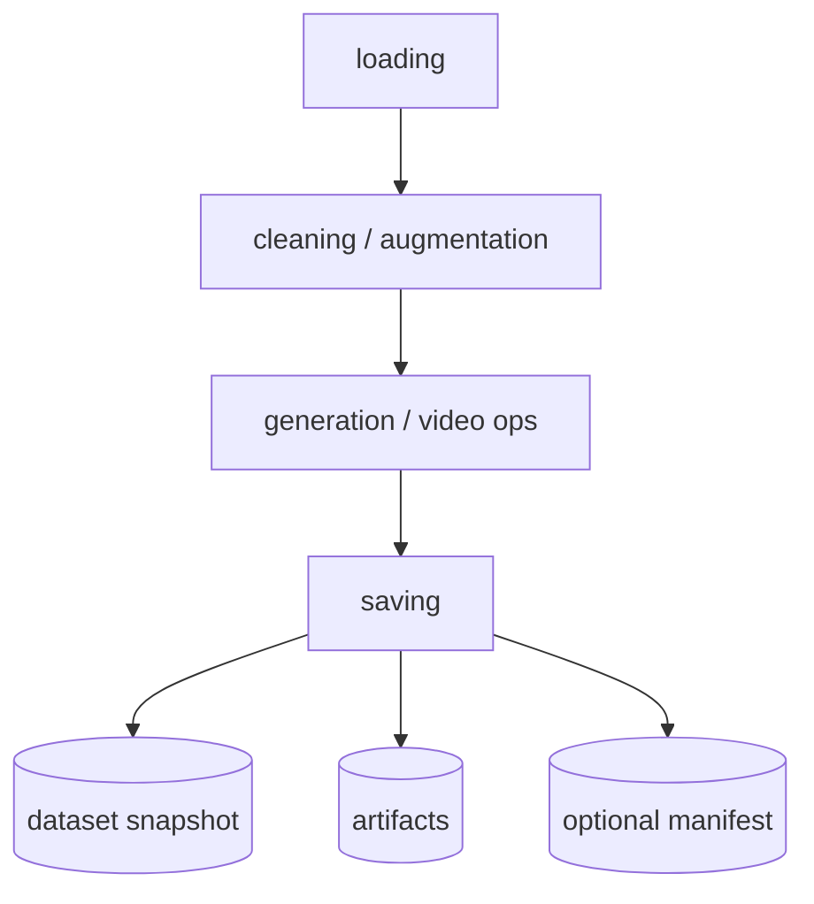
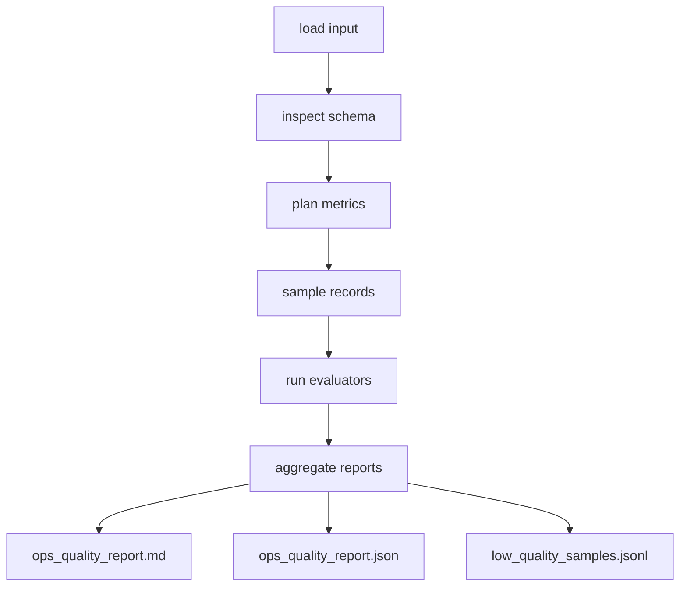

# Ops Quality Assessment

<section class="whitepaper-hero">
  <p class="hero-kicker">Multimodal Operator Quality Assessment</p>
  <h1>面向多模态算子的离线质量评估体系</h1>
  <p class="hero-copy">
    这份技术文档把原始规划报告拆分为可维护的网站结构，用于说明评估边界、
    执行链路、资源控制策略和八类核心指标定义。
  </p>
</section>

## 核心结论

!!! abstract "评估链路独立于主数据处理 pipeline"
    多模态语义质量评估不插入主数据处理 pipeline，也不由主 pipeline 在关键节点后触发。
    评估作为独立离线或异步任务读取已生成的数据产物、`MultimodalDataset` 快照、
    通用 manifest 或 tracking 记录，然后输出 Markdown、JSON 和低质样本清单。

<div class="doc-grid cards" markdown>

-   **轻量监控**

    `QualityPlugin` 已经可以在每个算子执行后调用 `DataQualityAssessor`，
    适合做字段完整性、类型一致性、唯一性和文本长度等基础质量检查。

-   **重模型评估**

    CLIP、BLIP、Cosmos-Embed、VLM/LLM judge、概念抽取和证据回溯等任务
    作为独立评估链路运行，避免拖慢或阻断数据生产。

-   **统一评估入口**

    `OpsQualityAssessor.evaluate(dataset_or_path, config)` 作为后续实现目标，
    支持 `MultimodalDataset`、Ray Dataset 路径、JSONL/Parquet/CSV 和 manifest。

</div>

## 评估链路总览

<div class="flow-grid" markdown>

<section class="flow-panel" markdown>
### 数据生产链路



</section>

<section class="flow-panel" markdown>
### 离线评估链路



</section>

</div>

??? info "展开完整端到端链路"
    ```mermaid
    flowchart LR
        subgraph P[Data Processing Pipeline]
            A[loading] --> B[cleaning / augmentation]
            B --> C[generation / video ops]
            C --> D[saving]
        end

        D --> E[(dataset snapshot)]
        D --> F[(artifacts)]
        D --> G[(optional manifest)]

        subgraph Q[Ops Quality Assessor]
            H[load input] --> I[inspect schema]
            I --> J[plan metrics]
            J --> K[sample records]
            K --> L[run evaluators]
            L --> M[aggregate reports]
        end

        E --> H
        F --> H
        G --> H
        M --> N[ops_quality_report.md]
        M --> O[ops_quality_report.json]
        M --> R[low_quality_samples.jsonl]
    ```

## 必测指标

| 指标 | 主要问题 | 默认级别 |
| --- | --- | --- |
| [`image_text_alignment`](metrics/image-text-alignment.md) | 图像与 caption 是否语义一致 | `standard` |
| [`video_image_alignment`](metrics/video-image-alignment.md) | 采样帧是否代表视频片段 | `standard` |
| [`qae_grounding_alignment`](metrics/qae-grounding-alignment.md) | 问题、答案与证据是否可回溯 | `deep` |
| [`coherence_score`](metrics/coherence-score.md) | 分段、描述、事件链是否连贯 | `standard` |

## 阅读路径

1. 先读 [设计目标](design-goals.md)，确认为什么评估体系按能力而不是算子类型组织。
2. 再读 [Pipeline 边界](pipeline-boundary.md)，区分轻量 `DataQualityAssessor` 与离线语义评估。
3. 进入 [独立评估链路](evaluation-flow.md) 和 [资源控制](resource-control.md)，理解后续实现的执行模型。
4. 最后查看 [指标定义](metrics/index.md) 与 [报告格式](report-format.md)，用于实现评估器和验收报告。
