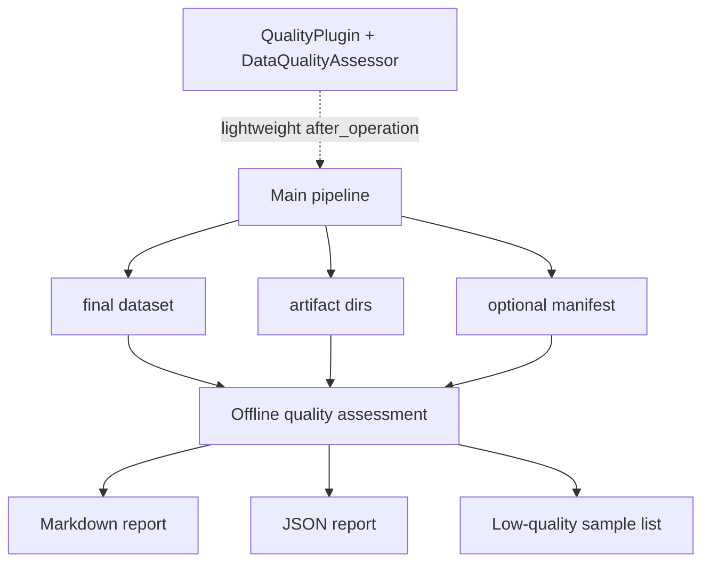

# Pipeline 边界

## 当前轻量监控链路

AscendDataForge 当前已有 `QualityPlugin`，可以在 pipeline 每个算子执行后调用 `DataQualityAssessor`：

```text
MultimodalPipeline.run() 每轮 operation.execute() 后
  -> 遍历 self._plugins.values() 调 after_operation()
  -> QualityPlugin.after_operation()
  -> DataQualityAssessor.assess(output_ds, operation.name)
```

这条链路适合做轻量监控，例如：

- 字段完整性。
- 类型一致率。
- 唯一值比例。
- 文本长度统计。
- 空值率和基础异常值。

## 为什么重模型评估不插入主 pipeline

本评估规划包含 CLIP、BLIP、Cosmos-Embed、VLM/LLM judge、概念抽取、视频片段证据回溯等重模型评估。如果把它们插入主数据处理 pipeline，会带来明显耦合：

- 数据生产链路必须感知评估指标和模型配置。
- 重模型推理会拖慢数据处理吞吐。
- 某个评估模型失败可能阻断本应成功的数据处理任务。
- 采样策略、模型版本、报告格式变化频繁，不适合绑定主链路。

## 推荐边界



主 pipeline 只负责生成数据与通用产物元信息，不感知具体评估指标。评估链路独立启动、独立配置、独立产出报告。

## Manifest 边界

主 pipeline 可以选择性生成通用 manifest，但 manifest 不包含任何具体评估指标逻辑。

```json
{
  "dataset_uri": "/path/to/final_dataset",
  "format": "jsonl",
  "modalities": ["image", "video", "text"],
  "schema_fields": [
    "image_path",
    "caption",
    "video_path",
    "segments",
    "samples",
    "description_units",
    "text_signals",
    "temporal_structures",
    "qae_triplets"
  ],
  "artifact_dirs": {
    "sample_frames": "/path/to/sample_frames"
  },
  "tracking_uri": "/path/to/tracking_report.json"
}
```
