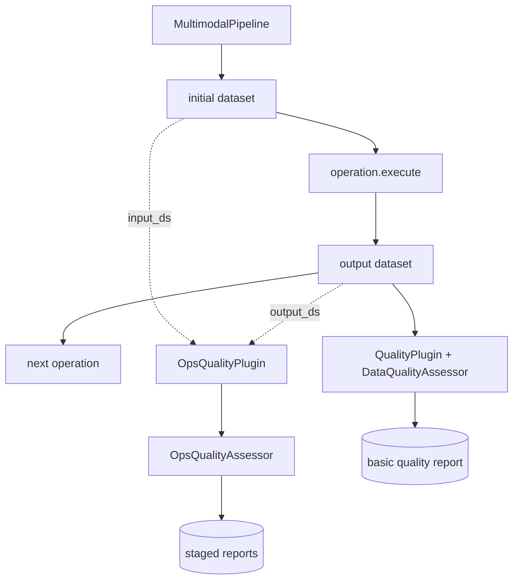

# Pipeline 边界

## 当前基础质量链路

AscendDataForge 已有 `QualityPlugin`，可以在 pipeline 每个算子执行后调用 `DataQualityAssessor`：

```text
MultimodalPipeline.run() 每轮 operation.execute() 后
  -> 遍历 self._plugins.values() 调 after_operation()
  -> QualityPlugin.after_operation()
  -> DataQualityAssessor.assess(output_ds, operation.name)
```

这条链路适合做轻量监控，例如：

- 字段完整性。
- 类型一致率。
- 唯一值比例。
- 文本长度统计。
- 空值率和基础异常值。

## OpsQualityPlugin 边界

`OpsQualityPlugin` 使用相同的插件机制，但面向语义层、跨模态层和证据层的算子产物评估。它可以读取：

- 每个算子后的 `output_ds`，用于评估当前产物质量。
- `input_ds` 和 `output_ds`，用于构造 before/after 型临时评估 rows。

插件只记录报告，不修改或替换 `MultimodalDataset`，因此不会把评估字段写回后续数据流。

## 推荐边界



主 pipeline 仍然只负责数据处理。两个 quality plugin 都是旁路观察者：

- `QualityPlugin` 负责基础字段质量。
- `OpsQualityPlugin` 负责多模态算子产物质量。

## 数据流约束

- 插件不得改变 `operation.execute()` 的返回数据。
- 插件评估失败只记录 `warning` 日志，不阻断 pipeline。
- before/after 型 metric 在插件内部构造临时评估 rows，例如 `before_text=input_ds.text`、`after_text=output_ds.text`，不写回后续数据流。
